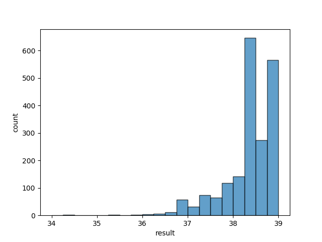
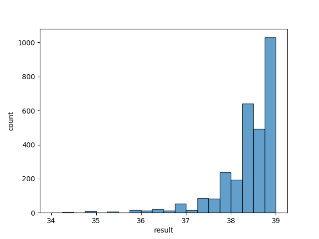
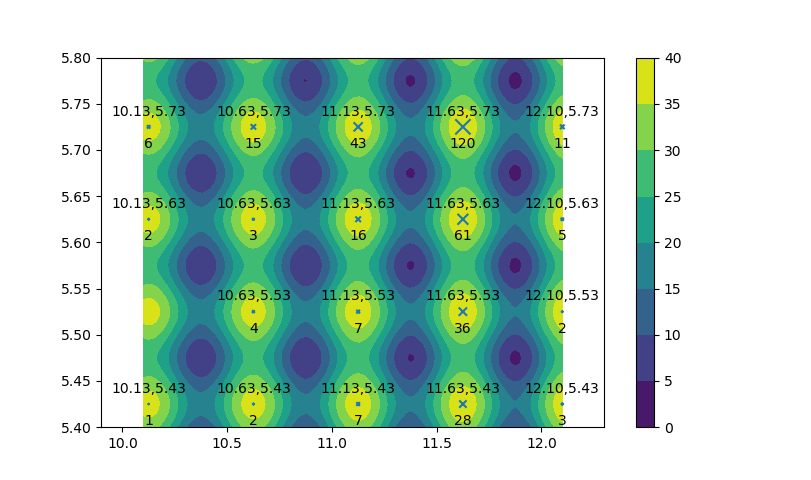

# Compare table
|Task: argmax|parameters|average speed|accuracy(~38.8503)|
|---|---|---|---|
|GA|ITER=1000 N=10 E=2 PC=0.6 PM=0.1|18.55ms|35.20% (176/500)|
||ITER=500 N=50 E=2 PC=0.6 PM=0.1|41.35ms|63.20% (316/500)|
||ITER=1000 N=50 E=2 PC=0.6 PM=0.1|72.00ms|68.20% (341/500)|
||ITER=1000 N=200 E=2 PC=0.6 PM=0.1|357.93ms|71.00% (71/100)|
||ITER=500 N=100 E=5 PC=0.6 PM=0.1|109.10ms|73.20% (366/500)|
||ITER=1000 N=100 E=5 PC=0.6 PM=0.1|197.83ms|75.00% (375/500)|
|GA_noselection|ITER=1000 N=10 PC=0.6 PM=0.1|8.76ms|48.20% (241/500)|
||ITER=500 N=50 PC=0.6 PM=0.1|23.24ms|83.80% (419/500)|
||ITER=1000 N=50 PC=0.6 PM=0.1|39.80ms|88.20% (441/500)|
||ITER=500 N=100 PC=0.6 PM=0.1|44.18ms|94.80% (474/500)|
||ITER=500 N=200 PC=0.6 PM=0.1|83.47ms|99.40% (497/500)|
|(repeat 10)|ITER=500 N=10 PC=0.6 PM=0.1|49.40ms|98.80% (494/500)|
|SA|delta=0.998|**2.52ms**|24.00% (120/500)|
||delta=0.999|4.41ms|54.00% (270/500)|
||delta=0.9995|9.80ms|80.80% (404/500)|
||delta=0.9998|22.65ms|97.40% (487/500)|
||delta=0.9999|45.48ms|98.00% (490/500)|
|PSO|ITER=500 N=50 C1=C2=1|14.00ms|83.00% (415/500)|
||ITER=1000 N=50|26.71ms|97.40% (487/500)|
||ITER=500 N=100|24.95ms|97.60% (488/500)|
||ITER=1000 N=100|53.24ms|**100.00% (500/500)**|
||ITER=500 N=50 C1=C2=1.5|16.83ms|94.00% (470/500)|
||ITER=500 N=50 C1=C2=2|27.34ms|99.20% (496/500)|

|Task: 01Backpack|parameters|average speed|accuracy(sumv=3103)|
|---|---|---|---|
|GA|ITER=500 N=100 E=2 PC=0.6 PM=0.05|187.67ms|67.00% (67/100)|
||ITER=1000 N=100 E=2 PC=0.6 PM=0.1|312.57ms|73.00% (73/100)|

# Result distribution analyze
  
task=argmax algo=genetic  ITER=250 N=10 E=2 PC=0.6 PM=0.1  
speed = 8.34ms  accuracy=6.00% (30/500)

  
task=argmax algo=SA  delta=0.998  
speed = 2.52ms  accuracy=24.00% (120/500)

  
Full target function

  
algo=SA delta=0.998  
Result distribution