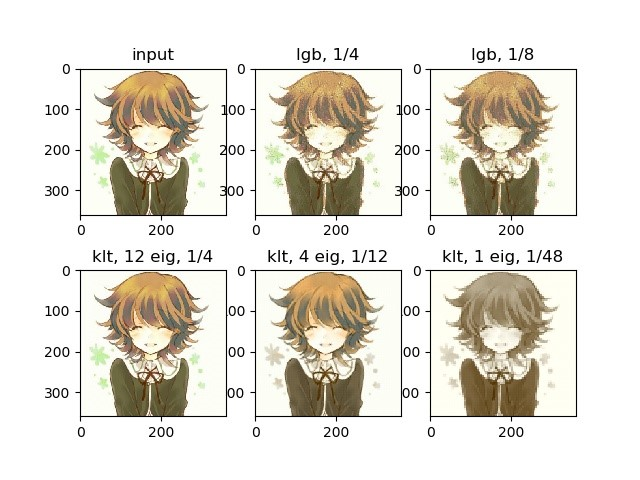

## K-L变换

### 算法描述

主成分分析，是通过正交变换投影为一系列不相关的变量。在信号处理中又称KLT。

可认为PCA解释了数据在哪个方向上对方差的贡献最大。

设数据矩阵为A。先对A做一次平均减法(中心化)。此时，A的协方差矩阵为 $\frac{1}{n-1}AA^T$。

先暂时忽略前面的系数。我们要求一个正交变换P，使PA在各个维度上不相关，则要求PA的协方差矩阵为对角阵。

即$PA(PA)^T=PAA^TP^T=\Lambda$。

根据特征分解的定义，P即原协方差矩阵的特征向量，$\Lambda$为特征值。

从几何上看，PCA计算了数据分布的n个最大轴向(主成分)，矩阵P代表特征方向，特征值代表方向上的方差。

 

既然一些方向上的特征值(方差)很小，可以忽略这些方向，把数据投影到重要的维度上，实现降维。例如图像处理中，方差小的往往是一些噪声或不被关心的高频细节。数据处理中，我们期望数据分布在低维线性子空间中，PCA需要挖掘出这种关系。

对于数据压缩，我们只需要保存UΣV中特征值大的部分。

### 测试

数据集是68040个32维的向量。这里算法计算出特征值和正交变换矩阵，选择了前16个特征值进行压缩，这样数据的压缩率达到50%。

对数据集进行KLT变换效果不太直观，因此我对图片也尝试进行压缩。KLT在图片压缩上的效果见下方图示。

## 矢量量化

### 算法描述

矢量量化思想和量化类似，都是使用近似值来代替原始值，但这里直接寻找一个尽可能相近的矢量。从编码上看，编码空间被划分为一些区域，每个区域为选取一个代表性的矢量作为量化结果，称为码矢。全体码矢的集合称为码书。

LBG算法是一个用于矢量量化的迭代算法。矢量量化的结果中，每个样本选取最近的码矢作为它的代表，而这个码矢是它所代表集合的均值。

算法开始时，整个集合仅包含一个码矢，为所有编码的均值。在每个迭代步骤中，码书被扩大一倍， 方法为对当前码书添加一正一负的随机扰动进行分裂。这样，在重新计算训练样本最接近的码矢时，原先归属于同一个码矢的样本会分裂为两部分。然后再重新计算均值，更新每个码矢的值。

左上方为原始输入图片，大小360*360。

### 测试

图像压缩时，将图分割为4*4的小块，按RGB三个通道，为4*4*3=48维向量。X方向和Y方向均为90块，相当于对8100个48维向量进行压缩。

第一行展示了LGB码矢数量为2048和1024情况下的压缩效果。

第二行展示了KL变换保留12，4，1个特征值下的效果。

标注中的1/N为对图像的压缩率。