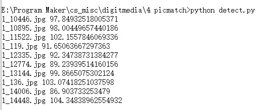
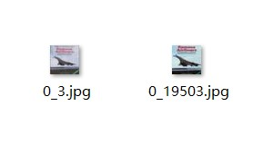

## 图像索引：SIFT或BOF算法特征提取匹配

### SIFT特征提取

DoG尺度空间的极值检测： 首先是构造DoG尺度空间，在SIFT中使用不同参数的高斯模糊来表示不同的尺度空间。而构造尺度空间是为了检测在不同尺度下都存在的特征点，特征点的检测比较常用的方法是Δ2G（高斯拉普拉斯LoG），但是LoG的运算量是比较大的，可以使用DoG（差分高斯）来近似计算LoG，所以在DoG的尺度空间下检测极值点。

删除不稳定的极值点：主要删除两类：低对比度的极值点以及不稳定的边缘响应点。

确定特征点的主方向：以特征点的为中心、以3×1.5σ为半径的领域内计算各个像素点的梯度的幅角和幅值，然后使用直方图对梯度的幅角进行统计。直方图的横轴是梯度的方向，纵轴为梯度方向对应梯度幅值的累加值，直方图中最高峰所对应的方向即为特征点的方向。

生成特征点的描述子： 首先将坐标轴旋转为特征点的方向，以特征点为中心的16×16的窗口的像素的梯度幅值和方向，将窗口内的像素分成16块，每块是其像素内8个方向的直方图统计，共可形成128维的特征向量。 

### 特征匹配

有了两幅图中的特征，就可以进行匹配了。最简单的方法是计算两个特征的欧氏距离的平方(SSD)， 每个点直接取与它SSD最小的点。匹配的强度取它们的距离，只要距离小于阈值就认为是合适的匹配。

一种更优的做法是比率测试(Ratio Test)。如果说一个匹配可信度高，那么它应该与次小值相比近很多。

### 测试

在cifar数据集中进行测试，对测试集中的第一张图找到训练集中与之最相似的图片。

在cifar数据集中进行测试，对测试集中的第一张图找到训练集中与之最相似的图片。

如图，算法会依次遍历训练集的所有图片，进行SIFT特征提取并计算相似度，最后选出相似度最大的图片作为结果。

如图，算法对于测试集中的第一张图0_3.jpg，匹配到了训练集的5000张图片中的0_19503.jpg。可见两张图确实十分相似。